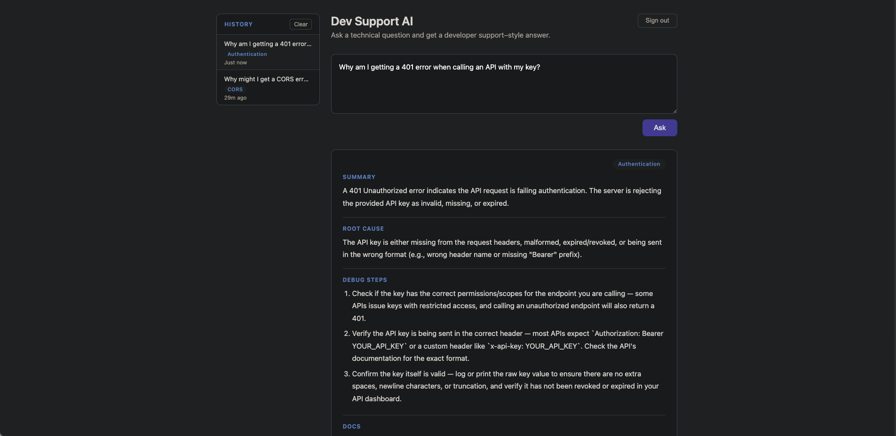

# Dev Support AI

A developer support chatbot that answers technical questions the way a developer support engineer would — structured, specific, and actionable. Built as a portfolio project to practice Claude API integration, prompt engineering, and modern web tooling.



## What it does

You type a technical question. The app streams back a response broken into four sections:

- **Summary** — a concise answer
- **Root Cause** — why the problem happens
- **Debug Steps** — numbered steps to resolve it
- **Docs** — relevant documentation links

Each response is also tagged with a product area (e.g. Authentication, Rate Limits, SDK) so answers are easy to scan at a glance. History is saved per-user in the cloud and visible in a sidebar.

## Stack

| Layer | Tech |
|-------|------|
| API | Python · Flask · Anthropic SDK |
| Auth | Clerk (sign-in gate + JWT verification) |
| Database | Convex (per-user history) |
| Frontend | Vite · Vanilla JS |

## Running locally

**Prerequisites:** Python 3, Node 18+, accounts on [Anthropic](https://console.anthropic.com), [Clerk](https://dashboard.clerk.com), and [Convex](https://dashboard.convex.dev).

**1. Clone and install**

```bash
git clone https://github.com/kesean/dev-support-chatbot.git
cd dev-support-chatbot
```

```bash
# Python deps
pip install -r requirements.txt

# Frontend deps
cd frontend && npm install
```

**2. Configure environment**

Copy `.env.example` to `.env` in the project root and fill in your keys:

```
ANTHROPIC_API_KEY=...
CLERK_SECRET_KEY=...
CLERK_JWKS_URL=...
```

Copy `.env.example` to `frontend/.env` and fill in the frontend keys:

```
VITE_CLERK_PUBLISHABLE_KEY=...
VITE_CONVEX_URL=...
```

To get your Convex URL, run `npx convex dev` from the `frontend/` directory once to initialize the project.

**3. Start the servers**

```bash
# Terminal 1 — Flask API (port 5001)
python app.py

# Terminal 2 — Vite frontend (port 5173)
cd frontend && npm run dev
```

Open [http://localhost:5173](http://localhost:5173).

## Project phases

### Phase 1 — Basic app
Minimal Flask backend with an `/ask` endpoint wired to the Claude API. Vanilla JS frontend with a textarea and button. Raw API response displayed in the UI.

### Phase 2 — Structured output
System prompt engineered to return responses in four labeled sections. Documentation links detected and rendered as clickable anchors. Error handling for malformed responses.

### Phase 3 — Streaming, history, product tags
Switched to `/ask/stream` using Server-Sent Events so responses stream in chunk by chunk. XML-tagged sections allow each part of the response to fade in incrementally as it arrives. Conversation history stored in localStorage with a sidebar UI. Product area tag badge added to each response.

### Phase 4/5 — Auth and data
Frontend migrated to Vite as an ES module build. Clerk added as a sign-in gate — unauthenticated users are redirected before they can reach the app. Flask verifies Clerk JWTs on every request using PyJWT. localStorage history replaced with a Convex database table scoped per user, so history persists across devices and sessions.
