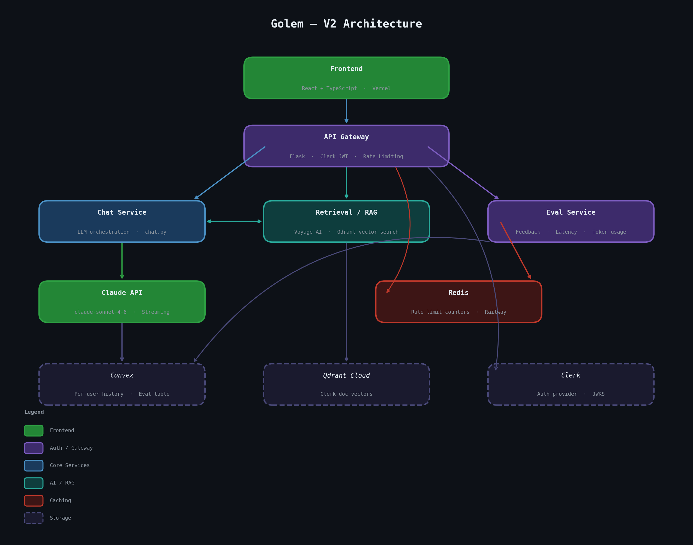

# Dev Support AI

A developer support chatbot that answers technical questions the way a developer support engineer would — structured, specific, and actionable. Built as a portfolio project to practice Claude API integration, prompt engineering, and modern web tooling.



## What it does

You type a technical question. The app streams back a response broken into four sections:

- **Summary** — a concise answer
- **Root Cause** — why the problem happens
- **Debug Steps** — numbered steps to resolve it
- **Docs** — relevant documentation links

Each response is also tagged with a product area (e.g. Authentication, Rate Limits, SDK) so answers are easy to scan at a glance. History is saved per-user in the cloud and visible in a sidebar.

## Stack

| Layer | Tech |
|-------|------|
| API | Python · Flask · Anthropic SDK |
| Auth | Clerk (sign-in gate + JWT verification) |
| Database | Convex (per-user history) |
| Frontend | Vite · Vanilla JS |

## Running locally

**Prerequisites:** Python 3, Node 18+, accounts on [Anthropic](https://console.anthropic.com), [Clerk](https://dashboard.clerk.com), and [Convex](https://dashboard.convex.dev).

**1. Clone and install**

```bash
git clone https://github.com/kesean/dev-support-chatbot.git
cd dev-support-chatbot
```

```bash
# Python deps
pip install -r requirements.txt

# Frontend deps
cd frontend && npm install
```

**2. Configure environment**

Copy `.env.example` to `.env` in the project root and fill in your keys:

```
ANTHROPIC_API_KEY=...
CLERK_SECRET_KEY=...
CLERK_JWKS_URL=...
```

Copy `.env.example` to `frontend/.env` and fill in the frontend keys:

```
VITE_CLERK_PUBLISHABLE_KEY=...
VITE_CONVEX_URL=...
```

To get your Convex URL, run `npx convex dev` from the `frontend/` directory once to initialize the project.

**3. Start the servers**

```bash
# Terminal 1 — Flask API (port 5001)
python app.py

# Terminal 2 — Vite frontend (port 5173)
cd frontend && npm run dev
```

Open [http://localhost:5173](http://localhost:5173).

## Project phases

### Phase 1 — Basic app

| Feature | Status |
|---------|--------|
| Flask app scaffolding | ✅ Done |
| Anthropic SDK integration | ✅ Done |
| `/ask` POST endpoint | ✅ Done |
| Vanilla JS frontend with textarea + button | ✅ Done |
| Raw API response displayed in UI | ✅ Done |

### Phase 2 — Structured output

| Feature | Status |
|---------|--------|
| System prompt engineering for structured responses | ✅ Done |
| Four-section response: Summary, Root Cause, Debug Steps, Docs | ✅ Done |
| Docs rendered as clickable links when URLs detected | ✅ Done |
| Error handling for malformed responses | ✅ Done |

### Phase 3 — Streaming, history, product tags

| Feature | Status |
|---------|--------|
| `/ask` endpoint with response streaming | ✅ Done |
| XML-tagged section format for incremental rendering | ✅ Done |
| Per-section streaming: text fades in chunk by chunk | ✅ Done |
| Response card fades in on first content arrival | ✅ Done |
| Conversation history (localStorage) | ✅ Done |
| Chat thread UI showing prior Q&A exchanges | ✅ Done |
| Product area tags (e.g. Authentication, Rate Limits, SDK) | ✅ Done |
| Product area tag badge displayed in UI | ✅ Done |

### Phase 4 — Data, auth, users

| Feature | Status |
|---------|--------|
| Vite frontend setup (migrate from raw JS) | ✅ Done |
| Clerk auth — sign-in/sign-up gate | ✅ Done |
| Flask JWT verification on /ask | ✅ Done |
| Convex schema + history table | ✅ Done |
| Replace localStorage with Convex per-user history | ✅ Done |

### Phase 5 — Security hardening

| Feature | Status |
|---------|--------|
| Remove unprotected `/ask` endpoint | ✅ Done |
| Derive Convex userId server-side via `ctx.auth` | ✅ Done |
| Replace indefinite JWKS cache with 1-hour TTL | ✅ Done |
| Question length limit (2000 chars) + Content-Type validation | ✅ Done |
| Distinct JWT error logging (expired, malformed, JWKS failure) | ✅ Done |
| Per-IP rate limiting on `/ask` (20 req/min) | ✅ Done |

### Phase 6 — Polish & UX

| Feature | Status |
|---------|--------|
| Markdown rendering in responses (code blocks, bold, lists) | ✅ Done |
| Mobile-responsive layout | ✅ Done |
| Keyboard shortcut hint (⌘↵ / Ctrl+↵) | ✅ Done |
| Loading skeleton while waiting for response | ✅ Done |

### Phase 7 — Product features

| Feature | Status |
|---------|--------|
| Multi-turn conversation with New Conversation button | ✅ Done |
| Search/filter history sidebar | ✅ Done |
| Copy response to clipboard | ✅ Done |
| Shareable links via `?share=` param | ✅ Done |

### Phase 8 — Production deployment

| Feature | Status |
|---------|--------|
| Redis-backed rate limiting (replaces in-process limiter) | ✅ Done |
| Per-user daily limit: 10 requests/day (keyed to Clerk user ID) | ✅ Done |
| Global daily cap: 70 requests/day across all users | ✅ Done |
| CORS scoped to Vercel frontend origin | ✅ Done |
| Flask backend deployed to Railway (with Redis add-on) | ✅ Done |
| Frontend deployed to Vercel (Vite static build) | ✅ Done |
| Production environment variables configured (no secrets in code) | ✅ Done |

---

## V2 — AI system upgrades

### V2a — Observability

| Feature | Status |
|---------|--------|
| Log token usage + latency on every `/ask` request | 🔲 Planned |
| Convex eval table (query, response, latency, user feedback) | 🔲 Planned |

### V2b — Retrieval-Augmented Generation (RAG)

| Feature | Status |
|---------|--------|
| Embed Anthropic + Clerk documentation chunks | 🔲 Planned |
| Vector store (pgvector or Qdrant) | 🔲 Planned |
| Top-k retrieval injected into system prompt | 🔲 Planned |
| Orchestration layer with query classifier + routing logic | 🔲 Planned |

### V2c — Tool use

| Feature | Status |
|---------|--------|
| `retrieve_docs()` tool backed by vector search | 🔲 Planned |
| `api_lookup()` tool for live status / reference data | 🔲 Planned |
| LLM decides which tools to call per query | 🔲 Planned |

### V2d — Frontend upgrade

| Feature | Status |
|---------|--------|
| Migrate to React + TypeScript | 🔲 Planned |
| Restore streaming responses | 🔲 Planned |
| Debug panel showing retrieved doc chunks | 🔲 Planned |
