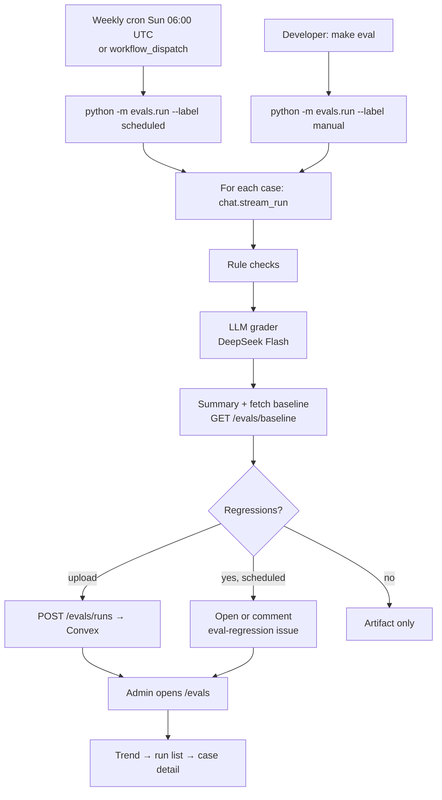
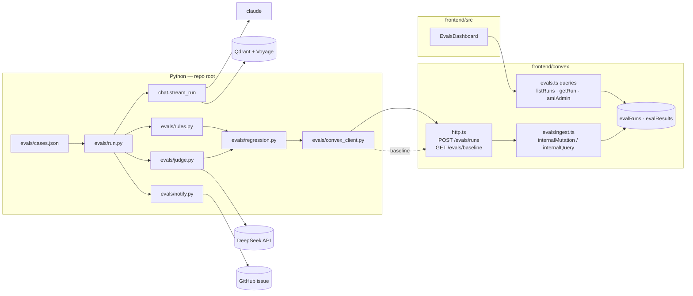

# Spec — V3a Eval harness

Status: draft for review · Date: 2026-10-01 · Phase: V3a (see README → V3 — Next steps)

## 1. Problem

Golem's answer quality is only visible one answer at a time, through thumbs feedback and the `docs-url-miss` log line. Nothing tells us whether a prompt, model, or retrieval change made answers better or worse overall. V3a adds a repeatable eval harness: a fixed set of test questions run through the real pipeline, graded by deterministic rules plus an LLM grader, stored as a trend, with a GitHub issue opened automatically when quality drops. Every later V3 phase is measured against it.

## 2. Requirements (EARS)

**R1 — Test set.** The system shall keep a versioned test set in `evals/cases.json`, where each case has an id, question, expected product tag, 2–4 key points, optional expected doc sources, and a category.
- [ ] `evals/cases.json` holds ≥ 30 cases covering at least: Clerk auth (≥ 10), MDN web platform such as CORS, fetch and streaming (≥ 8), rate limits/config (≥ 4), off-topic (≥ 3, expected tag `Other`), and prompt injection (≥ 3, expected tag `Other`).
- [ ] Every case validates against the `EvalCase` schema. Ids are unique. `expectedProductTag` is one of the 12 allowed tags in `prompt.py`.
- [ ] `pytest tests/test_evals_cases.py` passes.

**R2 — Run the real pipeline.** When a run starts, the system shall send every case through `chat.stream_run(question, [])` in-process, using the production prompt, model and retrieval. It does not call the deployed `/ask`, which would hit the 5/day limit.
- [ ] Each case records the response text, retrieved chunk URLs, latency, input and output tokens, or an error string.
- [ ] One case failing (exception or non-`end_turn`) is recorded with `error` set, and the run continues.
- [ ] Cases run with bounded concurrency (default 3).

**R3 — Rule checks.** When a case completes, the system shall evaluate these deterministic checks, each pass/fail:
- `completed`: there is no error.
- `format`: `<product_tag>`, `<summary>`, `<root_cause>`, `<debug_steps>` and `<docs>` are all present, and summary and root cause are non-empty.
- `productTag`: the parsed tag equals `expectedProductTag`.
- `citations`: `chat.find_unretrieved_doc_urls(response, chunks)` is empty.
- `retrieval`: when `expectedSources` is set, at least one retrieved chunk comes from each expected source. When it is unset, this check passes.
- [ ] `pytest tests/test_evals_rules.py` passes, covering one pass and one fail fixture per check.

**R4 — LLM grader.** When a case completes without an error, the system shall ask the grader model (default DeepSeek `deepseek-flash`) to score `groundedness` (1–5: supported by the retrieved chunks) and `coverage` (1–5: covers the case's key points), list the key points it missed, and give a ≤ 3-sentence reason, returned as JSON.
- [ ] The grader response is parsed and validated against a Pydantic `JudgeVerdict` model: scores are integers 1–5, `reason` is non-empty, and `keyPointsMissed` is a list of strings.
- [ ] Invalid JSON or a schema violation triggers exactly one retry. A second failure records `judge: null` and `judgeError: "invalid_output"`.
- [ ] The grader prompt includes the question, the key points, the retrieved chunk texts and the answer, with nothing else from the case.
- [ ] A grader failure records `judge: null` plus `judgeError`. The case still counts toward the rule metrics.
- [ ] `pytest tests/test_evals_judge.py` passes against a mocked HTTP transport (`httpx.MockTransport`), covering a valid verdict, invalid JSON then a valid retry, two invalid responses, and a missing `DEEPSEEK_API_KEY`.

**R5 — Summary and regression detection.** When all cases finish, the system shall compute a run summary and compare it with the baseline, which is the latest completed `scheduled` run in Convex. It flags a regression when any of these holds:
- (a) the mean judge score (the average of groundedness and coverage across graded cases) drops by more than 0.3;
- (b) a rule check that passed for a case in the baseline fails now;
- (c) a case's judge score drops by ≥ 2;
- (d) more than 20% of cases error;
- (e) the mean score is more than 0.5 below the best mean score of the last 8 completed `scheduled` runs (`recentBestMeanScore`). This catches a slow decline that never trips (a), because each week's baseline is the already-regressed run before it.

Acceptance:
- [ ] The summary includes the mean groundedness, coverage and score, the rule pass rate per check, p50 and p95 latency, total tokens, and the error count.
- [ ] When there is no baseline, regressions are empty and the report says "no baseline".
- [ ] `pytest tests/test_evals_regression.py` passes, with fixtures for each of a–e, for no baseline, and for a 0.2-per-week decline that trips (e) by week 3 while (a) never fires.

**R6 — Storage.** When a run finishes and upload is enabled, the system shall POST the run and its results to a Convex HTTP action authenticated with `EVAL_INGEST_SECRET`. The action stores them in `evalRuns` and `evalResults`.
- [ ] A request with a wrong or missing bearer gets 401 and nothing is written.
- [ ] A valid request writes 1 `evalRuns` row and N `evalResults` rows, and returns `{ runId }`.
- [ ] `GET /evals/baseline` with a valid bearer returns the latest completed scheduled run with its results plus `recentBestMeanScore` (the best `summary.meanScore` across the last 8 completed scheduled runs), or `null` when there are none.
- [ ] `npx vitest run convex/evals.harness.test.ts` passes.

**R7 — Local runs.** When a developer runs `make eval`, the system shall run all cases with label `manual`, print a Markdown report (summary, regressions, the worst 5 cases) to stdout, write `eval-out/run.json` and `eval-out/report.md`, and upload them unless `--no-upload` is passed.
- [ ] `python -m evals.run --cases evals/fixtures/two_cases.json --no-upload --dry-judge` runs offline, with the pipeline and grader stubbed by `--dry-judge` and `EVAL_FAKE_PIPELINE=1`, and exits 0.
- [ ] Exit codes: 0 = no regressions, 2 = regressions found, 1 = harness error.

**R8 — Scheduled run.** When the weekly schedule fires (Sunday 06:00 UTC, which is DeepSeek off-peak) or the workflow is dispatched manually, the system shall run the harness on `main` with label `scheduled`, upload the results, and attach `eval-out/` as a workflow artifact.
- [ ] `.github/workflows/eval-weekly.yml` has `schedule` and `workflow_dispatch` triggers and reads its secrets from repository secrets only.
- [ ] The workflow never runs on `pull_request` and never blocks a merge.
- [ ] The job succeeds on exit 2 (a regression), because the issue is the signal, and fails on exit 1.

**R9 — Regression alerting.** When a scheduled run has regressions or exits 1, the system shall open a GitHub issue labelled `eval-regression`. If one is already open, it shall comment on that issue instead. The issue or comment includes the run summary, each regression, and links to the dashboard run and the workflow run.
- [ ] There is at most one open `eval-regression` issue at a time.
- [ ] `pytest tests/test_evals_notify.py` passes, covering the issue body formatting and the create-vs-comment decision against a stubbed `gh`.

**R10 — Dashboard.** When an admin opens `/evals`, the system shall show:
- (a) a trend line of the mean judge score and the rule pass rate across the last 26 scheduled runs (about 6 months of weekly runs);
- (b) a run list of date, label, git SHA, mean score, pass rate and regression count;
- (c) for a selected run, each case's rules, scores, the grader's reason, missed key points, and the change from the previous scheduled run.

Acceptance:
- [ ] A signed-in user whose Convex `tokenIdentifier` is listed in the Convex env var `EVAL_ADMIN_IDS` sees the dashboard.
- [ ] Everyone else, including guests, sees "You don't have access to evals." and receives no eval data: the Convex queries throw `Forbidden`.
- [ ] Deep-linking to `/evals` works on Vercel because of an SPA rewrite.
- [ ] `npx vitest run tests/evalsDashboard.test.ts` passes. The `/evals` e2e test passes with axe clean in light and dark.

## 3. User flow



- **Scheduled run:** runs unattended and produces the artifact, the Convex rows and, when something regressed, an issue.
- **Local run (`make eval`):** a developer checks a prompt or model change before merging. The report prints in the terminal and is compared against the latest scheduled run.
- **GitHub issue:** the alert. It says what regressed and links to the dashboard run.
- **`/evals` dashboard:** the trend chart is on top. Clicking a run opens its case table, and expanding a case shows the answer, the rule results, the grader's reason and the changes from the previous run.

## 4. Architecture



### 4.1 Boundary interfaces (TypeScript; Python mirrors them as Pydantic models in `evals/models.py`)

```ts
type ProductTag = 'Authentication' | 'Rate Limits' | 'CORS' | 'SDK' | 'Networking' | 'Database'
  | 'Configuration' | 'Deployment' | 'Performance' | 'Streaming' | 'Debugging' | 'Other'
type DocSource = 'clerk' | 'mdn'
type EvalCategory = 'clerk-auth' | 'web-platform' | 'limits-config' | 'off-topic' | 'injection'

// evals/cases.json → { version: 1, cases: EvalCase[] }
interface EvalCase {
  id: string                 // kebab-case, unique
  question: string           // ≤ 2000 chars (same limit as /ask)
  expectedProductTag: ProductTag
  keyPoints: string[]        // 2–4 items
  expectedSources?: DocSource[]
  category: EvalCategory
}

interface RuleResults {
  completed: boolean
  format: boolean
  productTag: boolean
  citations: boolean
  retrieval: boolean
}

// Grader output (JSON, validated with Pydantic)
interface JudgeVerdict {
  groundedness: 1 | 2 | 3 | 4 | 5
  coverage: 1 | 2 | 3 | 4 | 5
  keyPointsMissed: string[]
  reason: string             // ≤ 3 sentences
}

interface CaseResult {
  caseId: string
  question: string
  response: string           // '' on error
  productTag: string | null  // parsed tag
  retrievedUrls: string[]
  rules: RuleResults
  judge: JudgeVerdict | null
  judgeError?: string
  latencyMs: number
  inputTokens: number
  outputTokens: number
  error?: string
}

interface RunSummary {
  caseCount: number
  gradedCount: number
  errorCount: number
  meanGroundedness: number
  meanCoverage: number
  meanScore: number          // mean of (groundedness + coverage) / 2 over graded cases
  rulePassRate: Record<keyof RuleResults, number>   // 0–1
  p50LatencyMs: number
  p95LatencyMs: number
  totalInputTokens: number
  totalOutputTokens: number
}

type Regression =
  | { kind: 'meanScoreDrop'; baseline: number; current: number }
  | { kind: 'ruleFlip'; caseId: string; rule: keyof RuleResults }
  | { kind: 'caseScoreDrop'; caseId: string; baseline: number; current: number }
  | { kind: 'errorRate'; errorCount: number; caseCount: number }
  | { kind: 'recentBestDrop'; recentBest: number; current: number }

interface EvalRunPayload {          // POST /evals/runs body
  run: {
    label: 'scheduled' | 'manual'
    gitSha: string
    gitRef: string
    appModel: string               // chat.MODEL
    judgeModel: string
    casesVersion: number
    startedAt: number              // epoch ms
    finishedAt: number
    status: 'completed' | 'errored'
    summary: RunSummary
    regressions: Regression[]
    baselineRunId: string | null
  }
  results: CaseResult[]
}
```

### 4.2 Data schema (Convex, added to `frontend/convex/schema.ts`)

```ts
evalRuns: defineTable({
  label: v.union(v.literal('scheduled'), v.literal('manual')),
  gitSha: v.string(), gitRef: v.string(),
  appModel: v.string(), judgeModel: v.string(), casesVersion: v.number(),
  startedAt: v.number(), finishedAt: v.number(),
  status: v.union(v.literal('completed'), v.literal('errored')),
  summary: v.object({ /* RunSummary fields */ }),
  regressions: v.array(v.any()),          // Regression[], validated in the HTTP action
  baselineRunId: v.optional(v.id('evalRuns')),
}).index('by_label_started', ['label', 'startedAt']),

evalResults: defineTable({
  runId: v.id('evalRuns'),
  caseId: v.string(), question: v.string(), response: v.string(),
  productTag: v.optional(v.string()), retrievedUrls: v.array(v.string()),
  rules: v.object({ completed: v.boolean(), format: v.boolean(), productTag: v.boolean(),
                    citations: v.boolean(), retrieval: v.boolean() }),
  judge: v.optional(v.object({ groundedness: v.number(), coverage: v.number(),
                               keyPointsMissed: v.array(v.string()), reason: v.string() })),
  judgeError: v.optional(v.string()),
  latencyMs: v.number(), inputTokens: v.number(), outputTokens: v.number(),
  error: v.optional(v.string()),
}).index('by_run', ['runId']).index('by_case', ['caseId']),
```

The existing `history`, `evals` and `stats` tables are unchanged. The existing `evals` table (per-answer production telemetry) is unrelated to `evalRuns` and `evalResults`.

### 4.3 Endpoints

| Surface | Name | Auth | Input → Output |
|---|---|---|---|
| Convex HTTP | `POST /evals/runs` | `Authorization: Bearer $EVAL_INGEST_SECRET` | `EvalRunPayload` → `200 { runId }` · `401` · `400 { error }` |
| Convex HTTP | `GET /evals/baseline` | same bearer | → `200 { run, results, recentBestMeanScore } \| null` (latest completed `scheduled`; best mean of the last 8) |
| Convex query | `evals.amIAdmin` | Clerk identity | `{}` → `boolean` |
| Convex query | `evals.listRuns` | admin | `{ limit?: number (≤ 60), label?: 'scheduled' \| 'manual' }` → run docs, newest first |
| Convex query | `evals.getRun` | admin | `{ runId }` → `{ run, results, previous: { run, results } \| null }` |
| CLI | `python -m evals.run` | env | `--label`, `--cases`, `--out`, `--no-upload`, `--dry-judge`, `--concurrency` → exit 0/1/2 |
| CLI | `python -m evals.notify` | `GH_TOKEN` | `--run eval-out/run.json --run-url <url>` → creates or comments on the issue |
| Web | `/evals` | admin | dashboard |

New secrets and environment variables:
- GitHub secrets: `ANTHROPIC_API_KEY`, `QDRANT_URL`, `QDRANT_API_KEY`, `VOYAGE_API_KEY`, `DEEPSEEK_API_KEY`, `CONVEX_SITE_URL`, `EVAL_INGEST_SECRET`.
- Optional overrides: `JUDGE_MODEL` (default `deepseek-flash`) and `JUDGE_BASE_URL` (default `https://api.deepseek.com`).
- Convex env: `EVAL_INGEST_SECRET`, `EVAL_ADMIN_IDS`.
- Local `.env`: the same names; `.env.example` gets updated.

## 5. Defaults I chose (override any)

1. **Grader model:** DeepSeek `deepseek-flash` (chosen for cost), set by `JUDGE_MODEL` / `JUDGE_BASE_URL` in `evals/judge.py` so a different OpenAI-compatible grader is an env change.
   - It is called with `httpx` (already a dependency) at `POST {JUDGE_BASE_URL}/chat/completions`, with `response_format: {type: "json_object"}` and `temperature: 0`.
   - The JSON is validated against Pydantic `JudgeVerdict`. Invalid output gets one retry, then is recorded as `judgeError`.
2. **Cost estimate (weekly, off-peak):**
   - Per case: about $0.014 for the app call (Sonnet 5) plus about $0.0008 for the grader (DeepSeek Flash, off-peak).
   - Per run of 30 cases: about **$0.44**, or about **$1.90/month** at 4.3 runs a month.
   - Running at peak would double the grader part only, to about $0.47 per run.
3. **Test set:** 30 hand-written cases that I draft for you to review. No production questions are mined, because those may contain user data.
4. **Pipeline:** answers come from in-process `chat.stream_run`, not the deployed `/ask`, which avoids the rate limits and auth. History is always empty, so cases are single-turn.
5. **Concurrency:** 3 cases at a time, to keep within Anthropic and Voyage rate limits. A run takes about 3–5 minutes.
6. **Thresholds:** a mean score drop above 0.3, a single-case drop of 2 or more, an error rate above 20%, or a score more than 0.5 below the best of the last 8 scheduled runs. Constants live in `evals/regression.py`.
7. **Baseline:** the latest completed scheduled run for run-to-run checks (a–d), and the best of the last 8 for the slow-decline check (e). Manual runs are stored but are never a baseline.
8. **Admin access:** a Convex env allowlist of Clerk `tokenIdentifier`s (`EVAL_ADMIN_IDS`). No roles system.
9. **Routing:** `/evals` is a pathname check in `main.tsx` plus a Vercel SPA rewrite in `vercel.json`. No router library is added.
10. **Trend chart:** inline SVG, with no chart dependency.
11. **Scheduled job status:** green on a regression (the issue is the signal) and red only when the harness itself breaks.
12. **Retention:** everything is kept; no pruning.
13. **Dependencies:** no new Python packages. Pydantic already comes with `anthropic`, cases are JSON rather than YAML, and HTTP uses `httpx` for both Convex and DeepSeek.
14. **Grader data:** grading prompts (the question, the key points, retrieved public Clerk/MDN doc text, and Golem's answer) are sent to DeepSeek's API. The cases are hand-written and contain no user data.
15. **Grader independence:** a non-Claude grader removes Claude grading its own family's answers, which is a side benefit of the cost choice.

## 6. Out of scope

- Grading production traffic or the existing `evals` telemetry table.
- Prompt or model hill-climbing and auto-tuning; V3a only measures.
- Blocking PRs or running evals on PRs.
- Multi-turn conversation cases.
- Editing cases or labelling answers from the dashboard (cases change by PR to `evals/cases.json`).
- Pairwise comparisons and human-preference labelling.
- Alerting outside GitHub (email, Slack).
- Changing the production prompt, model or retrieval.
